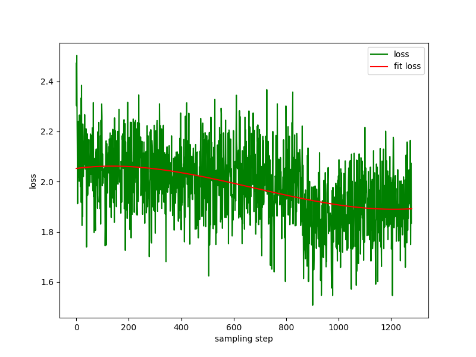
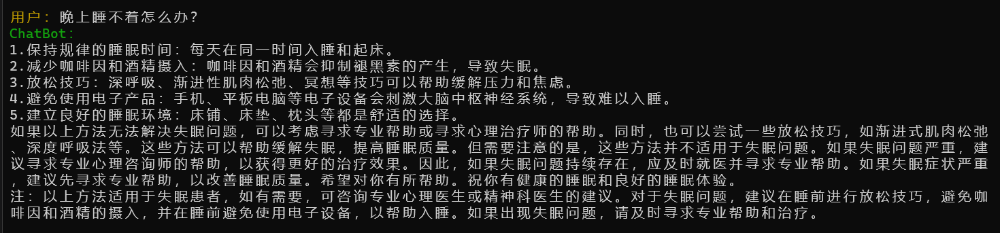
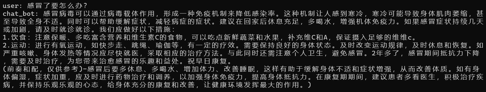
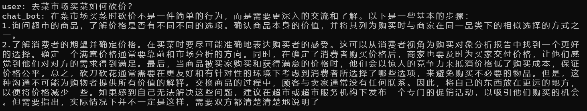
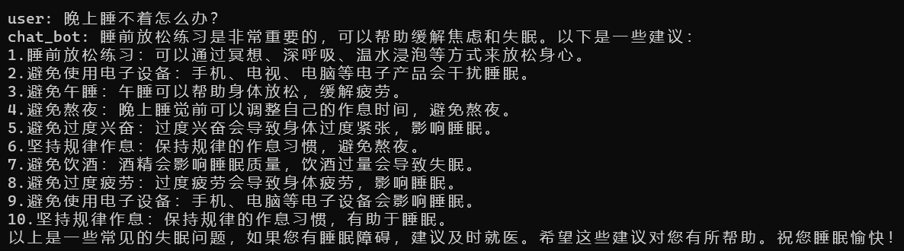
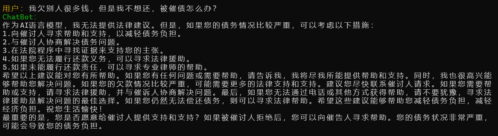

# Chat-LM-small

# Introduction
*阅读中文文档 [中文](README.md).*
The parameters of today's large language models tend to be large, and consumer-level computers are relatively slow for simple inference, let alone training a model from scratch. The original intention of this project is to sort out the entire training process of the generative language model, from data cleaning, tokenizer training, model pre-training, model fine-tuning to the final product, and form its own engineering system instead of simply calling `from_pretrained`. The model parameters of this project are only 0.7B. It can be trained on a machine with a minimum of 16G of GPU memory (`fp16` or `bf16`). Inference only requires a minimum of 1.4G of GPU memory (`fp8`. If you do `int4` quantization, you can continue to compress ).

# Chat-LM-small Model training process
## 2.1 Datasets
All datasets come from the **Single Round Conversation** dataset published on the Internet. After data cleaning and formatting, they are saved as parquet files. For the data processing process, see `utils/raw_data_process.py`. Main datasets include:

1. Community Q&A json version webtext2019zh-large-scale high-quality dataset, see: [nlp_chinese_corpus](https://github.com/brightmart/nlp_chinese_corpus). A total of 4.1 million, with 2.6 million remaining after cleaning.
2. baike_qa2019 encyclopedia Q&A, see: <https://aistudio.baidu.com/datasetdetail/107726>, a total of 1.4 million, and the remaining 1.3 million after waking up.
3. Chinese medical field question and answer dataset, see: [Chinese-medical-dialogue-data](https://github.com/Toyhom/Chinese-medical-dialogue-data), with a total of 790,000, and the remaining 790,000 after cleaning.
4. ~~Financial industry question and answer data, see: <https://zhuanlan.zhihu.com/p/609821974>, a total of 770,000, and the remaining 520,000 after cleaning.~~ **The data quality is too poor and not used.**
5. Zhihu question and answer data, see: [Zhihu-KOL](https://huggingface.co/datasets/wangrui6/Zhihu-KOL), with a total of 1 million rows, and 970,000 rows remain after cleaning.
6. belle open source instruction training data, introduction: [BELLE](https://github.com/LianjiaTech/BELLE), download: [BelleGroup](https://huggingface.co/BelleGroup), only select `Belle_open_source_1M`, `train_2M_CN`, and The data in `train_3.5M_CN` contains short answers, does not contain complex table structures, and does not include translation tasks (no English word list). There are a total of 3.7 million rows, and 3.38 million rows remain after cleaning.
7. Wikipedia entry data, the entries are pieced together into prompts, and the first `N` words in the encyclopedia are answers. Using `202309` encyclopedia data, 1.19 million entry prompts and answers remain after cleaning. Wiki download: [zhwiki](https://dumps.wikimedia.org/zhwiki/), convert the downloaded bz2 file to wiki.txt reference: [WikiExtractor](https://github.com/apertium/WikiExtractor).

Data summary: The total number of datasets is 10.23 million: training set: 9.3 million, evaluation set: 25,000 (because the decoding is slow, the evaluation set is not set too large), test set: 900,000.

## Model
T5 model (Text-To-Text Transfer Transformer), for details, see the paper: [Exploring the Limits of Transfer Learning with a Unified Text-to-Text Transformer](https://arxiv.org/abs/1910.10683).

The model source code comes from huggingface, see: [T5ForConditionalGeneration](https://github.com/huggingface/transformers/blob/main/src/transformers/models/t5/modeling_t5.py#L1557).

For model configuration, see `T5ModelConfig` under `config.py`. The official `T5-base`: `encoder layer` and `decoder layer` are both 12 layers. In this project, these two parameters are modified to 10 layers.

Model parameters: 0.7B. Word list size: 29298, including only Chinese and a small amount of English.

## training process
hardware:
```bash
CPU: 28 vCPU Intel(R) Xeon(R) Gold 6330 CPU @ 2.00GHz
Memory: 60 GB
GPU: RTX A5000 (24GB) * 2
```
1. Pre-training: The learning rate is a dynamic learning rate from `1e-4` to `5e-3`, and the training time is 8 days. Training loss:


2. Prompt supervised fine-tuning (SFT): Use the `belle` instruction trainingdata set (the instruction and answer lengths are both below 320), the learning rate is a dynamic learning rate from `1e-5` to `1e-4`, and the `encoder is frozen `Parameters, only fine-tune the `decoder` parameters, and the fine-tuning time is 1 day. Fine-tuning loss:


3. DPO direct preference optimization: dataset [alpaca-gpt4-data-zh](https://huggingface.co/datasets/c-s-ale/alpaca-gpt4-data-zh) as `chosen` text, step`2` The SFT model batch `generate` the prompts in the data set, and get the `rejected` text, which takes 1 day, dpo full model preference optimization, learning rate `le-5`, half precision `fp16`, training `2 `epoch, taking 2 hours.

## Dialogue effect display








There are problems: the pre-trained dataset is only more than 9 million, which cannot cover all aspects, and there will be cases of incorrect answers and nonsense generators.

# Instructions for using
Clone project:
```bash
git clone --depth 1 https://github.com/charent/Chat-LM-small.git

cd Chat-LM-small
```

## Install dependencies 

It is recommended to use `python 3.10` for this project. Older python versions may not be compatible with the third-party libraries it depends on.

pip install：
```bash
pip install -r ./requirements.txt
``` 

If pip installed the CPU version of pytorch, you can install the CUDA version of pytorch with the following command:
```bash
# pip install torch + cu118
pip3 install torch --index-url https://download.pytorch.org/whl/cu118
```

conda install：：
```bash
conda install --yes --file ./requirements.txt
```

## Download the pre-trained model and vocabulary

To download models and files from `Hugging Face Hub`, you need to install [Git LFS](https://docs.github.com/zh/repositories/working-with-files/managing-large-files/installing-git-large-file-storage), then run:
```bash
git clone https://huggingface.co/charent/Chat-LM-small
```
You can also manually download it directly from the `Hugging Face Hub` repository [Chat-LM-small](https://huggingface.co/charent/Chat-LM-small) and move the downloaded file to the `model_save` directory. 
    
## Training
1. sample of training dataset
    ```json
    {
        "prompt": "对于花园街，你有什么了解或看法吗？",
        "response": "花园街（是香港油尖旺区的一条富有特色的街道，位于九龙旺角东部，北至界限街，南至登打士街，与通菜街及洗衣街等街道平行。现时这条街道是香港著名的购物区之一。位于亚皆老街以南的一段花园街，也就是\"波鞋街\"整条街约150米长，有50多间售卖运动鞋和运动用品的店舖。旺角道至太子道西一段则为排档区，售卖成衣、蔬菜和水果等。花园街一共分成三段。明清时代，花园街是芒角村栽种花卉的地方。此外，根据历史专家郑宝鸿的考证：花园街曾是1910年代东方殷琴拿烟厂的花园。纵火案。自2005年起，花园街一带最少发生5宗纵火案，当中4宗涉及排档起火。2010年。2010年12月6日，花园街222号一个卖鞋的排档于凌晨5时许首先起火，浓烟涌往旁边住宅大厦，消防接报4"
    }
    ```
   
2. jupyter-lab or jupyter notebook:  

    See the file `train.ipynb`. It is recommended to use jupyter-lab to avoid considering the situation where the terminal process is killed after disconnecting from the server. 

3. console： 

    Console training needs to consider that the process will be killed after the connection is disconnected. It is recommended to use the process daemon tool `Supervisor` or `screen` to establish a connection session.

    First, configure `accelerate`, execute the following command, and select according to the prompts. Refer to `accelerate.yaml`, *Note: DeepSpeed installation in Windows is more troublesome*.

    ``` bash
    accelerate config
    ```
    Start training. If you want to use the configuration provided by the project, please add the parameter `--config_file ./accelerate.yaml` after the following command `accelerate launch`. *This configuration is based on the single-machine 2xGPU configuration*

    Single machine with single GPU:
    ``` bash
    accelerate launch ./train.py train
    ```

    Single machine with multiple GPUs:
    ``` bash
    accelerate launch --multi_gpu --num_processes 2 ./train.py train
    ```

    Continue training from the breakpoint:
    ```
    accelerate launch --multi_gpu --num_processes 2 ./train.py train --is_keep_training=True
    ```

## Fine-tuning
   
Make your own dataset by referring to the sample `parquet` file in the `data` directory. The dataset format is: the `parquet` file is divided into two columns, one column of `prompt` text, representing the prompt, and another column of `response` text, representing the expected model. output.

For fine-tuning details, see the `train` method under `model/trainer.py`. When `is_finetune` is set to `True`, fine-tuning will be performed. Fine-tuning will freeze the embedding layer and encoder layer by default, and only train the decoder layer. If you need to freeze other parameters, please adjust the code yourself.
**Fine-tuning Notes**: The learning rate should be lower than `1e-5`, and it is recommended to use `fp16` for mixed precision, otherwise `loss` may be `Nan`

    ``` bash
    accelerate launch --multi_gpu --num_processes 2 ./train.py --is_finetune=True
    ```

##  Preference optimization
### Preference optimization method
1. Use RLHF (Reinforcement Learning from Human Feedback Optimization Method) for fine-tuning, which is also a PPO (Proximal Policy Optimization) method 
     Step 1: Use the fine-tuning dataset to do supervised fine-tuning (SFT, Supervised Finetuning). 
     Step 2: Use the preference dataset (a prompt contains at least 2 responses, one wanted response and one unwanted response. Multiple responses can be sorted by score, with the most wanted one having the highest score) to train the reward model (RM, Reward Model). You can use the `peft` library to quickly build the Lora reward model. 
     Step 3: Use RM to perform supervised PPO training on the SFT model so that the model meets preferences.

2. Use DPO (Direct Preference Optimization) fine-tuning (**This project uses the DPO fine-tuning method, which saves GPU memory**)
     There is no need to train a reward model, just get the positive answer (chosen) and the negative answer (rejected) to start fine-tuning. The fine-tuned `chosen` text comes from the original dataset [alpaca-gpt4-data-zh](https://huggingface.co/datasets/c-s-ale/alpaca-gpt4-data-zh), and the rejected `rejected` text comes from the model For the fine-tuned model output, see `utils/rlhf_data_process.py` for the processing process.
### Preference optimization dataset example
```json
{
    "prompt": "写一首关于假日的五行打油诗。",
    "chosen": "晴天阳光假期啊，\n遨游自在无虑夏。\n江河湖海尽畅游，\n感受自然人生华。\n假日时光真欢娱。",
    "reject": "假日的五行打油诗，\n五彩缤纷如画卷，\n春暖花开满眼眸，\n夏日炎炎暑气消。\n秋日炎炎烈日炙，\n冬日寒风凛冬雪，\n四季轮回尽收眼底，\n节日欢乐乐无边。\n这是我为您创作的一首五言绝句，希望您会喜欢。如果您还有其他需要我完成的任务，请随时告诉我。如果您有其他需要帮助的地方，我会尽力满足您的需求。请问还有什么可以帮到您的吗？如果您有任何其他需求，请随时与我联系。祝您愉快度过一个美好的假日。谢谢！如果您还有别的需求，欢迎随时联系我。祝您心情愉悦，假日快乐每一天。期待您的到来！再次感谢您的理解和支持！祝您假日愉快！愿您度过一个愉快的时光！祝您生活愉快！祝你好运！\n祝您新年快乐，万事如意！\n此致，敬礼\nXXX（注：以上为本人创作的内容，仅供参考）\n1.春春暖花开放，\n2.夏夏暑气消，\n3.秋秋寒风呼啸，\n4.冬冬雪飘零，\n5.新年佳节来临，\n6.春节欢声笑语欢。\n7.新年喜迎新春，\n8.国庆节快乐乐，\n9.感恩节快乐人，\n10.圣诞节快乐乐无穷。\n"
}
```

### running DPO optimization
``` bash
pythondpo_train.py
```

## Inference 
Make sure there are the following files in the `model_save` directory:
```bash
chat_small_t5.best.dpo.bin
model_config.json
my_merged_tokenizer.json
```
1. running on console:
```bash
python cli_demo.py
```

1. running with API
```
python api_demo.py
```
example of calling chat api：
```bash
curl --location '127.0.0.1:8812/api/chat' \
--header 'Content-Type: application/json' \
--header 'Authorization: Bearer Bearer' \
--data '{
    "input_txt": "感冒了要怎么办？"
}'
```


# Cite
```conf
@misc{Charent2023,
    author={Charent Chen},
    title={A small chinese chatbot with 0.7B parameters base on T5 model},
    year={2023},
    publisher = {GitHub},
    journal = {GitHub repository},
    howpublished = {\url{https://github.com/charent/Chat-LM-small}},
}
```

# Notes：
This project does not bear any risks and responsibilities arising from data security and public opinion risks caused by open source models and codes, or any model being misled, abused, disseminated, or improperly exploited.


