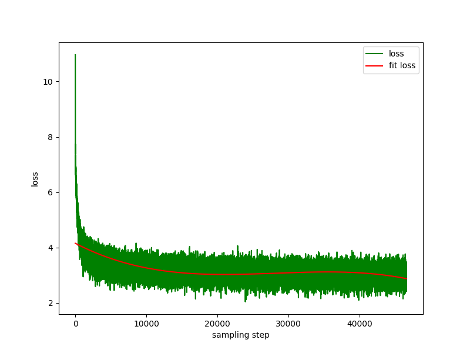
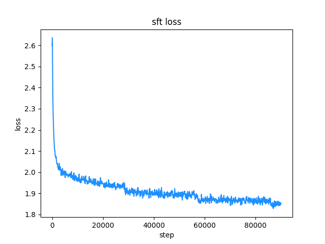
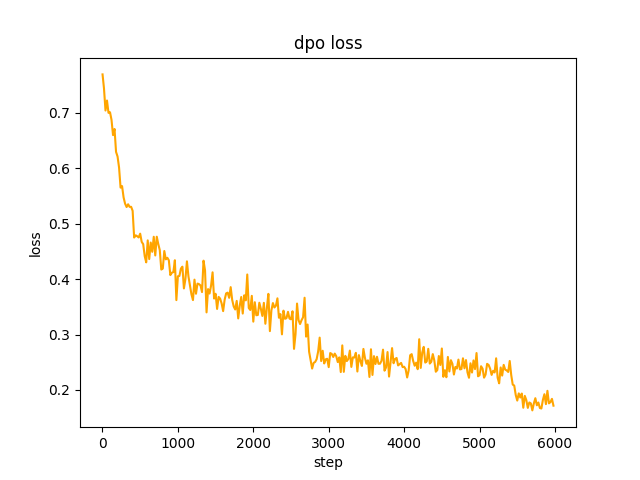
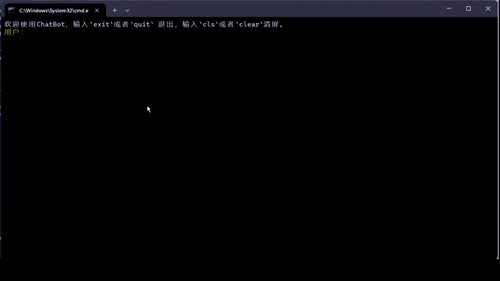
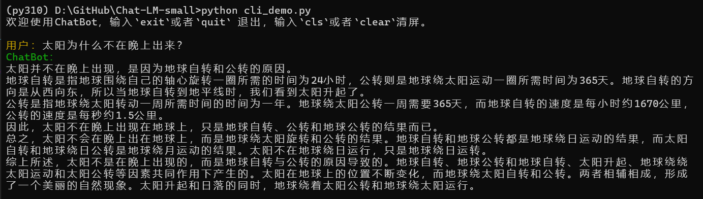
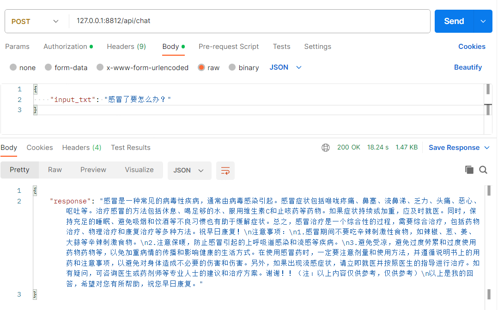

<div align="center">

# A Small Chat with Chinese Language Model: ChatLM-Chinese-0.2B 
 [中文](./README.md)  | English

</div>

# 1. 👋Introduction

Today's large language models tend to have large parameters, and consumer-grade computers are slow to do simple inference, let alone train a model from scratch. The goal of this project is to organize the training process of generative language models, including data cleaning, tokenizer training, model pre-training, SFT instruction fine-tuning, RLHF optimization, etc.

ChatLM-mini-Chinese is a small Chinese chat model with only 0.2B (added shared weight is about 210M) parameters. It can be pre-trained on  machine with a minimum of 4GB of GPU memory (`batch_size=1`, `fp16` or `bf16`), `float16` loading and inference only require a minimum of 512MB of GPU memory.

- Make public all pre-training, SFT instruction fine-tuning, and DPO preference optimization datasets sources.
- Use the `Huggingface` NLP framework, including `transformers`, `accelerate`, `trl`, `peft`, etc.
- Self-implemented `trainer`, supporting pre-training and SFT fine-tuning on a single machine with a single card or with multiple cards on a single machine. It supports stopping at any position during training and continuing training at any position.
- Pre-training: Integrated into end-to-end `Text-to-Text` pre-training, non-`mask` mask prediction pre-training.
     - Open source all data cleaning (such as standardization, document deduplication based on mini_hash, etc.), data set construction, data set loading optimization and other processes;
     - tokenizer multi-process word frequency statistics, supports tokenizer training of `sentencepiece` and `huggingface tokenizers`;
     - Pre-training supports checkpoint at any step, and training can be continued from the breakpoint;
     - Streaming loading of large datasets (GB level), supporting buffer data shuffling, does not use memory or hard disk as cache, effectively reducing memory and disk usage. configuring `batch_size=1, max_len=320`, supporting pre-training on a machine with at least 16GB RAM + 4GB GPU memory;
     - Training log record.
- SFT fine-tuning: open source SFT dataset and data processing process.
     - The self-implemented `trainer` supports prompt command fine-tuning and supports any breakpoint to continue training;
     - Support `sequence to sequence` fine-tuning of `Huggingface trainer`;
     - Supports traditional low learning rate and only trains fine-tuning of the decoder layer.
- Preference optimization: Use DPO to optimize all preferences.
     - Support using `peft lora` for preference optimization;
     - Supports model merging, `Lora adapter` can be merged into the original model.
- Support downstream task fine-tuning: [finetune_examples](./finetune_examples/info_extract/) gives a fine-tuning example of the **Triple Information Extraction Task**. The model dialogue capability after fine-tuning is still there.

If you need to do retrieval augmented generation (RAG) based on small models, you can refer to my other project [Phi2-mini-Chinese](https://github.com/charent/Phi2-mini-Chinese). For the code, see [rag_with_langchain.ipynb](https://github.com/charent/Phi2-mini-Chinese/blob/main/rag_with_langchain.ipynb)

🟢**Latest Update**

<summary> <b>2024-01-07</b> </summary>
- Add document deduplication based on mini hash during the data cleaning process (in this project, it's to deduplicated the rows of datasets actually). Prevent the model from spitting out training data during inference after encountering multiple repeated data. <br/>
- Add the `DropDatasetDuplicate` class to implement deduplication of documents from large data sets. <br/>
</details>

<details close>
<summary> <b>2023-12-29</b> </summary>
- Update the model code (weights is NOT changed), you can directly use `AutoModelForSeq2SeqLM.from_pretrained(...)` to load the model for using. <br/>
- Updated readme documentation. <br/>
</details>

<details close>
<summary> <b>2023-12-18</b> </summary>
- Supplementary use of the `ChatLM-mini-0.2B` model to fine-tune the downstream triplet information extraction task code and display the extraction results. <br/>
- Updated readme documentation. <br/>
</details>

<details close>
<summary> <b>2023-12-14</b> </summary>
- Updated model weight files after SFT and DPO. <br/>
- Updated pre-training, SFT and DPO scripts. <br/>
- update `tokenizer` to `PreTrainedTokenizerFast`. <br/>
- Refactor the `dataset` code to support dynamic maximum length. The maximum length of each batch is determined by the longest text in the batch, saving GPU memory. <br/>
- Added `tokenizer` training details. <br/>
</details>

<details close>
<summary> <b>2023-12-04</b> </summary>
- Updated `generate` parameters and model effect display. <br/>
- Updated readme documentation. <br/>
</details>

<details close>
<summary> <b>2023-11-28</b> </summary>
- Updated dpo training code and model weights. <br/>
</details>

<details close>
<summary> <b>2023-10-19</b> </summary>
- The project is open source and the model weights are open for download. <br/>
</details>

# 2. 🛠️ChatLM-0.2B-Chinese model training process
## 2.1 Pre-training dataset
All datasets come from the **Single Round Conversation** dataset published on the Internet. After data cleaning and formatting, they are saved as parquet files. For the data processing process, see `utils/raw_data_process.py`. Main datasets include:

1. Community Q&A json version webtext2019zh-large-scale high-quality dataset, see: [nlp_chinese_corpus](https://github.com/brightmart/nlp_chinese_corpus). A total of 4.1 million, with 2.6 million remaining after cleaning.
2. baike_qa2019 encyclopedia Q&A, see: <https://aistudio.baidu.com/datasetdetail/107726>, a total of 1.4 million, and the remaining 1.3 million after waking up.
3. Chinese medical field question and answer dataset, see: [Chinese-medical-dialogue-data](https://github.com/Toyhom/Chinese-medical-dialogue-data), with a total of 790,000, and the remaining 790,000 after cleaning.
4. ~~Financial industry question and answer data, see: <https://zhuanlan.zhihu.com/p/609821974>, a total of 770,000, and the remaining 520,000 after cleaning. ~~**The data quality is too poor and not used. **
5. Zhihu question and answer data, see: [Zhihu-KOL](https://huggingface.co/datasets/wangrui6/Zhihu-KOL), with a total of 1 million rows, and 970,000 rows remain after cleaning.
6. belle open source instruction training data, introduction: [BELLE](https://github.com/LianjiaTech/BELLE), download: [BelleGroup](https://huggingface.co/BelleGroup), only select `Belle_open_source_1M` , `train_2M_CN`, and `train_3.5M_CN` contain some data with short answers, no complex table structure, and translation tasks (no English vocabulary list), totaling 3.7 million rows, and 3.38 million rows remain after cleaning.
7. Wikipedia entry data, piece together the entries into prompts, the first `N` words of the encyclopedia are the answers, use the encyclopedia data of `202309`, and after cleaning, the remaining 1.19 million entry prompts and answers . Wiki download: [zhwiki](https://dumps.wikimedia.org/zhwiki/), convert the downloaded bz2 file to wiki.txt reference: [WikiExtractor](https://github.com/apertium/WikiExtractor).

The total number of datasets is 10.23 million: Text-to-Text pre-training set: 9.3 million, evaluation set: 25,000 (because the decoding is slow, the evaluation set is not set too large). ~~Test set: 900,000~~
SFT fine-tuning and DPO optimization datasets are shown below.

## 2.2 Model
T5 model (Text-to-Text Transfer Transformer), for details, see the paper: [Exploring the Limits of Transfer Learning with a Unified Text-to-Text Transformer](https://arxiv.org/abs/1910.10683).

The model source code comes from huggingface, see: [T5ForConditionalGeneration](https://github.com/huggingface/transformers/blob/main/src/transformers/models/t5/modeling_t5.py#L1557).

For model configuration, see [model_config.json](https://huggingface.co/charent/ChatLM-mini-Chinese/blob/main/config.json). The official `T5-base`: `encoder layer` and `decoder layer` are both 12 layers. In this project, these two parameters are modified to 10 layers.

Model parameters: 0.2B. Word list size: 29298, including only Chinese and a small amount of English.

## 2.3 Training process
hardware:
```bash
# Pre-training phase:
CPU: 28 vCPU Intel(R) Xeon(R) Gold 6330 CPU @ 2.00GHz
Memory: 60 GB
GPU: RTX A5000 (24GB) * 2

# sft and dpo stages:
CPU: Intel(R) i5-13600k @ 5.1GHz
Memory: 32 GB
GPU: NVIDIA GeForce RTX 4060 Ti 16GB * 1
```

1. **tokenizer training**: The existing `tokenizer` training library has OOM problems when encountering large corpus. Therefore, the full corpus is merged and constructed according to word frequency according to a method similar to `BPE`, and the operation takes half a day.
   
2. **Text-to-Text pre-training**: The learning rate is a dynamic learning rate from `1e-4` to `5e-3`, and the pre-training time is 8 days. Training loss:


3. **prompt supervised fine-tuning (SFT)**: Use the `belle` instruction training dataset (both instruction and answer lengths are below 512), with a dynamic learning rate from `1e-7` to `5e-5` , the fine-tuning time is 2 days. Fine-tuning loss:


4. **dpo direct preference optimization**: dataset [alpaca-gpt4-data-zh](https://huggingface.co/datasets/c-s-ale/alpaca-gpt4-data-zh) as `chosen` text , in step `2`, the SFT model performs batch `generate` on the prompts in the dataset, and obtains the `rejected` text, which takes 1 day, dpo full preference optimization, learning rate `le-5`, half precision `fp16`, total `2` `epoch`, taking 3h. dpo loss:


## 2.4 chat show
### 2.4.1 stream chat
By default, `TextIteratorStreamer` of `huggingface transformers` is used to implement streaming dialogue, and only `greedy search` is supported. If you need `beam sample` and other generation methods, please change the `stream_chat` parameter of `cli_demo.py` to `False` .


### 2.4.2 Dialogue show


There are problems: the pre-training dataset only has more than 9 million, and the model parameters are only 0.2B. It cannot cover all aspects, and there will be situations where the answer is wrong and the generator is nonsense.

# 3. 📑Instructions for using
## 3.1 Quick start:
```python
from transformers import AutoTokenizer, AutoModelForSeq2SeqLM
import torch

model_id = 'charent/ChatLM-mini-Chinese'
device = torch.device('cuda' if torch.cuda.is_available() else 'cpu')

tokenizer = AutoTokenizer.from_pretrained(model_id)
model = AutoModelForSeq2SeqLM.from_pretrained(model_id, trust_remote_code=True).to(device)

txt = '如何评价Apple这家公司？'

encode_ids = tokenizer([txt])
input_ids, attention_mask = torch.LongTensor(encode_ids['input_ids']), torch.LongTensor(encode_ids['attention_mask'])

outs = model.my_generate(
    input_ids=input_ids.to(device),
    attention_mask=attention_mask.to(device),
    max_seq_len=256,
    search_type='beam',
)

outs_txt = tokenizer.batch_decode(outs.cpu().numpy(), skip_special_tokens=True, clean_up_tokenization_spaces=True)
print(outs_txt[0])
```
```txt
Apple是一家专注于设计和用户体验的公司，其产品在设计上注重简约、流畅和功能性，而在用户体验方面则注重用户的反馈和使用体验。作为一家领先的科技公司，苹果公司一直致力于为用户提供最优质的产品和服务，不断推陈出新，不断创新和改进，以满足不断变化的市场需求。
在iPhone、iPad和Mac等产品上，苹果公司一直保持着创新的态度，不断推出新的功能和设计，为用户提供更好的使用体验。在iPad上推出的iPad Pro和iPod touch等产品，也一直保持着优秀的用户体验。
此外，苹果公司还致力于开发和销售软件和服务，例如iTunes、iCloud和App Store等，这些产品在市场上也获得了广泛的认可和好评。
总的来说，苹果公司在设计、用户体验和产品创新方面都做得非常出色，为用户带来了许多便利和惊喜。

```

## 3.2 from clone code repository start

The model of this project is the `TextToText` model. In the `prompt`, `response` and other fields of the pre-training stage, SFT stage, and RLFH stage, please be sure to add the `[EOS]` end-of-sentence mark.    
The model of this project is the `TextToText` model. In the `prompt`, `response` and other fields of the pre-training stage, SFT stage, and RLFH stage, please be sure to add the `[EOS]` end-of-sentence mark.    
The model of this project is the `TextToText` model. In the `prompt`, `response` and other fields of the pre-training stage, SFT stage, and RLFH stage, please be sure to add the `[EOS]` end-of-sentence mark.    

### 3.2.1 Clone repository
```bash
git clone --depth 1 https://github.com/charent/ChatLM-mini-Chinese.git

cd ChatLM-mini-Chinese
```
### 3.2.2 Install dependencies
It is recommended to use `python 3.10` for this project. Older python versions may not be compatible with the third-party libraries it depends on.

pip installation:
```bash
pip install -r ./requirements.txt
```

If pip installed the CPU version of pytorch, you can install the CUDA version of pytorch with the following command:
```bash
# pip install torch + cu118
pip3 install torch --index-url https://download.pytorch.org/whl/cu118
```

conda installation:
```bash
conda install --yes --file ./requirements.txt
```

### 3.2.3 Download the pre-trained model and model configuration file

Download model weights and configuration files from `Hugging Face Hub`, you need to install [Git LFS](https://docs.github.com/zh/repositories/working-with-files/managing-large-files/installing-git-large -file-storage), then run:

```bash
git clone --depth 1 https://huggingface.co/charent/ChatLM-mini-Chinese
```

You can also manually download it directly from the `Hugging Face Hub` warehouse [ChatLM-mini-Chinese](https://huggingface.co/charent/ChatLM-mini-Chinese) and move the downloaded file to the `model_save` directory. .
    

## 3.3 Tokenizer training

I originally planned to directly use the ready-made `tokenizer` library for training (such as `sentencepiece`), but it is easy to OOM when the dataset is large. In addition, the corpus in various fields of the pre-training dataset is unbalanced, which will produce many unnecessary mergers. Finally, use `jieba` word segmentation to segment all the pre-training corpus and count the word frequency, and only retain words and words that appear more than 1500 times. Refer to the `BPE model` saving format of `PreTrainedTokenizerFast` to construct `tokenzier`, and finally convert it to `PreTrainedTokenizerFast`. The core code is as follows. For detailed processing, see `utils/train_tokenizer.py`.


```python
# Construct merge array
words_merge_list = []
for word in words_dict.keys():
    n = len(word)
    if n >= 2:
        # a, b split 12345 example： 1 2345,  12 345,   123 45,   1234 5
        for i in range(1, n):
            a, b = ''.join(word[0: i]), ''.join(word[i: ])

            if a in words_dict and b in words_dict:
                words_merge_list.append((a, b))
```
This project also provides an example of using the `tokenizer` that comes with the pre-trained model to retrain the `tokenizer` based on your own corpus, see `train_tokenizer.ipynb`. Note that after retraining `tokenizer`, the weights of the pre-trained model will not be available, and the model weights need to be retrained because the `id` corresponding to `token` has changed.

## 3.4 Text-to-Text pre-training
1. Pre-training dataset example
```json
{
    "prompt": "对于花园街，你有什么了解或看法吗？",
    "response": "花园街（是香港油尖旺区的一条富有特色的街道，位于九龙旺角东部，北至界限街，南至登打士街，与通菜街及洗衣街等街道平行。现时这条街道是香港著名的购物区之一。位于亚皆老街以南的一段花园街，也就是\"波鞋街\"整条街约150米长，有50多间售卖运动鞋和运动用品的店舖。旺角道至太子道西一段则为排档区，售卖成衣、蔬菜和水果等。花园街一共分成三段。明清时代，花园街是芒角村栽种花卉的地方。此外，根据历史专家郑宝鸿的考证：花园街曾是1910年代东方殷琴拿烟厂的花园。纵火案。自2005年起，花园街一带最少发生5宗纵火案，当中4宗涉及排档起火。2010年。2010年12月6日，花园街222号一个卖鞋的排档于凌晨5时许首先起火，浓烟涌往旁边住宅大厦，消防接报4"
}
```

2. jupyter-lab or jupyter notebook:

     See the file `train.ipynb`. It is recommended to use jupyter-lab to avoid considering the situation where the terminal process is killed after disconnecting from the server.

3. Console:

    Console training needs to consider that the process will be killed after the connection is disconnected. It is recommended to use the process daemon tool `Supervisor` or `screen` to establish a connection session.

     First, configure `accelerate`, execute the following command, and select according to the prompts. Refer to `accelerate.yaml`, *Note: DeepSpeed installation in Windows is more troublesome*.
     ```bash
     accelerate config
     ```

     Start training. If you want to use the configuration provided by the project, please add the parameter `--config_file ./accelerate.yaml` after the following command `accelerate launch`. *This configuration is based on the single-machine 2xGPU configuration.*  

     *There are two scripts for pre-training. The trainer implemented in this project corresponds to `train.py`, and the trainer implemented by huggingface corresponds to `pre_train.py`. You can use either one and the effect will be the same. The training information display of the trainer implemented in this project is more beautiful, and it is easier to modify the training details (such as loss function, log records, etc.). All support checkpoint to continue training. The trainer implemented in this project supports continuing training after a breakpoint at any position. Press ` ctrl+c` will save the breakpoint information when exiting the script.*

     Single machine and single card:
     ```bash
     # The trainer implemented in this project
     accelerate launch ./train.py train

     # Or use huggingface trainer
     python pre_train.py
     ```

     Single machine with multiple cards:
     ```bash
     # The trainer implemented in this project
     accelerate launch --multi_gpu --num_processes 2 ./train.py train

     # Or use huggingface trainer
     python pre_train.py
     ```

     Continue training from the breakpoint:
     ```
     # The trainer implemented in this project
     accelerate launch --multi_gpu --num_processes 2 ./train.py train --is_keep_training=True

     # Or use huggingface trainer
     # You need to add `resume_from_checkpoint=True` to the `train` function in `pre_train.py`
     python pre_train.py
     ```

## 3.5 Supervised Fine-tuning, SFT

The SFT dataset all comes from the contribution of [BELLE](https://github.com/LianjiaTech/BELLE). Thank you. The SFT datasets are: [generated_chat_0.4M](https://huggingface.co/datasets/BelleGroup/generated_chat_0.4M), [train_0.5M_CN](https://huggingface.co/datasets/BelleGroup/train_0.5M_CN ) and [train_2M_CN](https://huggingface.co/datasets/BelleGroup/train_2M_CN), about 1.37 million rows remain after cleaning.
Example of fine-tuning dataset with sft command:

```json
{
    "prompt": "解释什么是欧洲启示录",
    "response": "欧洲启示录（The Book of Revelation）是新约圣经的最后一卷书，也被称为《启示录》、《默示录》或《约翰默示录》。这本书从宗教的角度描述了世界末日的来临，以及上帝对世界的审判和拯救。 书中的主题包括来临的基督的荣耀，上帝对人性的惩罚和拯救，以及魔鬼和邪恶力量的存在。欧洲启示录是一个充满象征和暗示的文本，对于解读和理解有许多不同的方法和观点。"
}
```
Make your own dataset by referring to the sample `parquet` file in the `data` directory. The dataset format is: the `parquet` file is divided into two columns, one column of `prompt` text, representing the prompt, and one column of `response` text, representing the expected model. output.
For fine-tuning details, see the `train` method under `model/trainer.py`. When `is_finetune` is set to `True`, fine-tuning will be performed. Fine-tuning will freeze the embedding layer and encoder layer by default, and only train the decoder layer. If you need to freeze other parameters, please adjust the code yourself.

Run SFT fine-tuning:
```bash
# For the trainer implemented in this project, just add the parameter `--is_finetune=True`. The parameter `--is_keep_training=True` can continue training from any breakpoint.
accelerate launch --multi_gpu --num_processes 2 ./train.py --is_finetune=True

# Or use huggingface trainer
python sft_train.py
```

## 3.6 RLHF (Reinforcement Learning Human Feedback Optimization Method)

Here are two common preferred methods: PPO and DPO. Please search papers and blogs for specific implementations.

1. PPO method (approximate preference optimization, Proximal Policy Optimization)  
     Step 1: Use the fine-tuning dataset to do supervised fine-tuning (SFT, Supervised Finetuning).  
     Step 2: Use the preference dataset (a prompt contains at least 2 responses, one wanted response and one unwanted response. Multiple responses can be sorted by score, with the most wanted one having the highest score) to train the reward model (RM, Reward Model). You can use the `peft` library to quickly build the Lora reward model.   
     Step 3: Use RM to perform supervised PPO training on the SFT model so that the model meets preferences.   

2. Use DPO (Direct Preference Optimization) fine-tuning (**This project uses the DPO fine-tuning method, which saves GPU memory**)
     On the basis of obtaining the SFT model, there is no need to train the reward model, and fine-tuning can be started by obtaining the positive answer (chosen) and the negative answer (rejected). The fine-tuned `chosen` text comes from the original dataset [alpaca-gpt4-data-zh](https://huggingface.co/datasets/c-s-ale/alpaca-gpt4-data-zh), and the rejected text `rejected` comes from SFT Model output after fine-tuning 1 epoch, two other datasets: [huozi_rlhf_data_json](https://huggingface.co/datasets/Skepsun/huozi_rlhf_data_json) and [rlhf-reward-single-round-trans_chinese](https:// huggingface.co/datasets/beyond/rlhf-reward-single-round-trans_chinese), a total of 80,000 dpo data after the merger.
    
     For the dpo dataset processing process, see `utils/dpo_data_process.py`.
    
DPO preference optimization dataset example:
```json
    {
        "prompt": "为给定的产品创建一个创意标语。，输入：可重复使用的水瓶。",
        "chosen": "\"保护地球，从拥有可重复使用的水瓶开始！\"",
        "rejected": "\"让你的水瓶成为你的生活伴侣，使用可重复使用的水瓶，让你的水瓶成为你的伙伴\""
    }
```
Run preference optimization:
```bash
pythondpo_train.py
```

## 3.7 Infering
Make sure there are the following files in the `model_save` directory, These files can be found in the `Hugging Face Hub` repository [ChatLM-Chinese-0.2B](https://huggingface.co/charent/ChatLM-mini-Chinese)::
```bash
ChatLM-mini-Chinese
├─model_save
|  ├─config.json
|  ├─configuration_chat_model.py
|  ├─generation_config.json
|  ├─model.safetensors
|  ├─modeling_chat_model.py
|  ├─special_tokens_map.json
|  ├─tokenizer.json
|  └─tokenizer_config.json
```

1. Console run:
```bash
python cli_demo.py
```

2. API call
```bash
python api_demo.py
```

API call example:
API调用示例：
```bash
curl --location '127.0.0.1:8812/api/chat' \
--header 'Content-Type: application/json' \
--header 'Authorization: Bearer Bearer' \
--data '{
    "input_txt": "感冒了要怎么办"
}'
```


## 3.8 Fine-tuning of downstream tasks

Here we take the triplet information in the text as an example to do downstream fine-tuning. Traditional deep learning extraction methods for this task can be found in the repository [pytorch_IE_model](https://github.com/charent/pytorch_IE_model). Extract all the triples in a piece of text, such as the sentence `"Sketching Essays" is a book published by Metallurgical Industry in 2006, the author is Zhang Lailiang`, extract the triples `(Sketching Essays, author, Zhang Lailiang)` and `( Sketching essays, publishing house, metallurgical industry)`.

The original dataset is: [Baidu Triplet Extraction dataset](https://aistudio.baidu.com/datasetdetail/11384). Example of the processed fine-tuned dataset format:
```json
{
    "prompt": "请抽取出给定句子中的所有三元组。给定句子：《家乡的月亮》是宋雪莱演唱的一首歌曲，所属专辑是《久违的哥们》",
    "response": "[(家乡的月亮,歌手,宋雪莱),(家乡的月亮,所属专辑,久违的哥们)]"
}
```

You can directly use the `sft_train.py` script for fine-tuning. The script [finetune_IE_task.ipynb](./finetune_examples/info_extract/finetune_IE_task.ipynb) contains the detailed decoding process. The training dataset is about `17000`, the learning rate is `5e-5`, and the training epoch is `5`. The dialogue capabilities of other tasks have not disappeared after fine-tuning.


Fine-tuning effects:
The public `dev` dataset of `Baidu triple extraction dataset` is used as a test set to compare with the traditional method [pytorch_IE_model](https://github.com/charent/pytorch_IE_model).

| Model | F1 score | Precision | Recall |
| :--- | :----: | :---: | :---: |
| ChatLM-Chinese-0.2B fine-tuning | 0.74 | 0.75 | 0.73 |
| ChatLM-Chinese-0.2B without pre-training | 0.51 | 0.53 | 0.49 |
| Traditional deep learning method | 0.80 | 0.79 | 80.1 |

Note: `ChatLM-Chinese-0.2B without pre-training` means directly initializing random parameters, starting training, learning rate `1e-4`, and other parameters are consistent with fine-tuning.

# 4. 🎓Citation
If you think this project is helpful to you, please site it.
```conf
@misc{Charent2023,
    author={Charent Chen},
    title={A small chinese chat language model with 0.2B parameters base on T5},
    year={2023},
    publisher = {GitHub},
    journal = {GitHub repository},
    howpublished = {\url{https://github.com/charent/ChatLM-mini-Chinese}},
}
```

# 5. 🤔Other matters
This project does not bear any risks and responsibilities arising from data security and public opinion risks caused by open source models and codes, or any model being misled, abused, disseminated, or improperly exploited.
